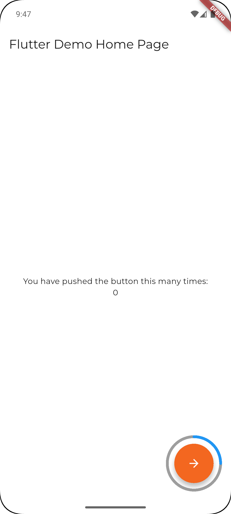

# progressive_fab

A Flutter package providing a progressive Floating Action Button (FAB) for your applications.



## Features

- Customizable progressive FAB for Flutter.
- Easy integration and usage.

## Installation

Add the following to your `pubspec.yaml`:

```yaml
dependencies:
  progressive_fab: ^1.0.0
```

Then run:

```sh
flutter pub get
```

## Usage


Import the package:

```dart
import 'package:progressive_fab/progressive_fab.dart';
```

Use the widget in your app:

```dart
import 'package:flutter/material.dart';
import 'package:progressive_fab/progressive_fab.dart';

class MyHomePage extends StatelessWidget {
  final double _progress = 0.5;

  void _incrementProgress() {
    // Your logic to increment progress
  }

  @override
  Widget build(BuildContext context) {
    return Scaffold(
      floatingActionButton: ProgressiveFAB(
        progress: _progress,
        onPressed: _incrementProgress,
        icon: const Icon(Icons.add),
        fabColor: Colors.blue,
        progressColor: Colors.green,
        borderColor: Colors.grey.shade300,
        iconColor: Colors.white,
        size: 80,
        padding: 10,
      ),
      // ...other properties...
    );
  }
}
```

## License

This project is licensed under the MIT License. See the [LICENSE](LICENSE) file for details.
